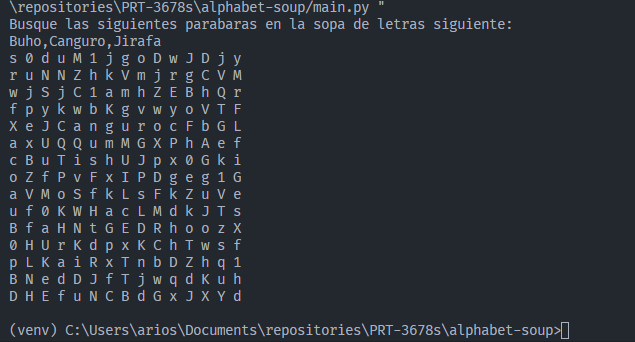
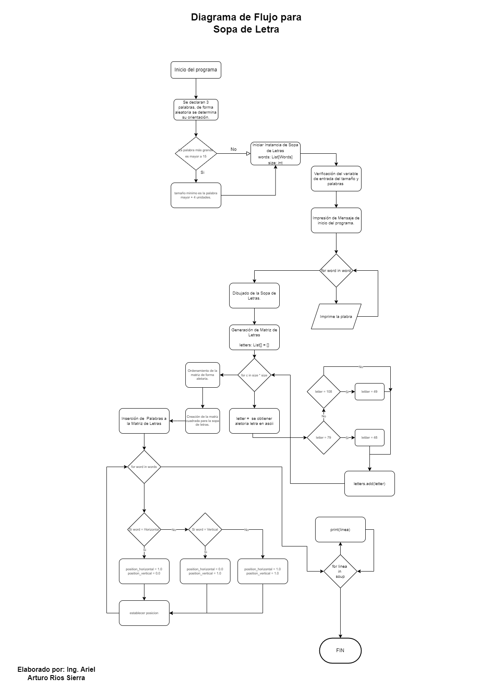

# Ejercicio Técnico "Sopa de Letras"


<br>


<br>


## Para levantar este proyecto
Nos tenemos que posicionar en la carpeta [alphabet-soup](../alphabet-soup).

Creamos un ambiente virtual para mejor manejo del proyecto con los comandos:

```
python -m virutalenv .venv
```

En caso de no tener el paquete de virutalenv podemos instalarlo en el sistema con el siguiente comando:
```
pip install virtualenv
```

Finalmente ejecutamos el ambiente virutal.

En windows
```
venv\Scripts\activate
```

En mac o linux
```
source venv/bin/activate
```

Una vez en nuestro ambiente virtual instalamos nuestras dependencias mediante:

```
pip install -r requirements.txt
```


Y corremos el programa de main.py:
```
python main.py
```

### Debugger
Para vscode, se puede revisar la configuración de los debugger (python) por si se quiere implementar, esto se encuentran [aquí](.vscode/launch.json)

### Ejemplo de funcionamiento:



## Se deja a continuación el diagrama de flujo de este proyecto:

